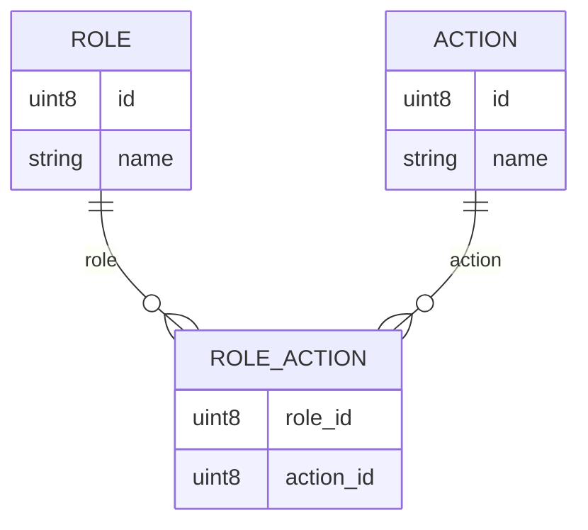

# Knowledge Text Formatting Guide
Full formatting guide: [Markdown Guide](https://www.markdownguide.org/)

## Text Styles 
- `**Bold**`: **Bold Text**
- `_Italic_`: _Italic Text_
- `**_Bold Italic_**`: **_Bold Italic Text_**
- `~~Strikeout~~`: ~~Strikeout Text~~
- `**_~~Bold Italic Strikeout~~_**`: **_~~Bold Italic Strikeout Text~~_**

## Local Link

Local Link starts from root folder of the repository: `/`.

`[Knowledge Structures Guide](/guides/knowledge-structures-guide.md )`

[Knowledge Structures Guide](/guides/knowledge-structures-guide.md )

## Global Link

Global Link starts from a website url: `https://`.

`[model Logic](https://github.com/arina-network/arina-knowledge/tree/main/models/logic)`

[model Logic](https://github.com/arina-network/arina-knowledge/tree/main/models/logic)

## Email

`<test.user@pozotron.com>`

<test.user@pozotron.com>

## Diagram

Only a local link to `.svg` file.

``

## Image

Only a local link to `.jpg` or `.png` files.

``

## Headers

```
# Header A, Level 1
## Header AA, Level 2
### Header AAA, Level 3
#### Header AAAA, Level 4
```

# Header A, Level 1
## Header AA, Level 2
### Header AAA, Level 3
#### Header AAAA, Level 4

## Line Break

```
Line 1 with two or more spaces  
Line 2
```

Line 1 with two or more spaces  
Line 2

## Horizontal line

`---`

---

## Ordered List

```
1. Level 1, Item A
    1. Level 2, Item AA
        1. Level 3, Item AAA
        2. ...
    2. ...
2. ...        
```

1. Level 1, Item A
    1. Level 2, Item AA
        1. Level 3, Item AAA
        2. ...
    2. ...
2. ...        

## Unordered List

```
- Level 1, Item A
    - Level 2, Item AA
        - Level 3, Item AAA
        - ...
    - ...
- Level 1, Item B
- ...        
```

- Level 1, Item A
    - Level 2, Item AA
        - Level 3, Item AAA
        - ...
    - ...
- Level 1, Item B
- ...     

## Task List

```
- [ ] Task 1
- [X] Task 2
- [ ] Task 3 
```

- [ ] Task 1
- [X] Task 2
- [ ] Task 3 

## Comment

\`// Multi-line\`   
\`// Comment\`

`// Multi-line`   
`// Comment`

\- List:
<br>&nbsp;&nbsp;&nbsp;&nbsp;\- Item 1 \`// Inline Comment\`
<br>&nbsp;&nbsp;&nbsp;&nbsp;\- ...

- List:
    - Item 1 `// Inline Comment`
    - ...

## Comment - Invisible

```
Single-line
<!-- This is a single-line comment -->

Multi-line
<!-- 
This is a 
multi-line comment 
-->
```

Single-line
<!-- This is a single-line comment -->

Multi-line
<!-- 
This is a 
multi-line comment 
-->

## Blockquotes  

`> Blockquotes`

> Blockquotes
 
## Source code - Inline  

```
This line contains `Source code - Inline` as an example.
```

This line contains `Source code - Inline` as an example. 

## Source code - Multilines

\`\`\`
<br>Source code - Multilines
<br>&nbsp;&nbsp;&nbsp;&nbsp;Line 1
<br>&nbsp;&nbsp;&nbsp;&nbsp;Line 2
<br>&nbsp;&nbsp;&nbsp;&nbsp;&nbsp;&nbsp;&nbsp;&nbsp;Line 3
<br>&nbsp;&nbsp;&nbsp;&nbsp;&nbsp;&nbsp;&nbsp;&nbsp;...
<br>&nbsp;&nbsp;&nbsp;&nbsp;...
<br>\`\`\`

```
Source code - Multilines
    Line 1
    Line 2
        Line 3
        ...
    ...
```

## Source code - Programming Language

\`\`\`json
<br>{
<br>&nbsp;&nbsp;&nbsp;&nbsp;"firstName": "John",
<br>&nbsp;&nbsp;&nbsp;&nbsp;"lastName": "Smith",
<br>&nbsp;&nbsp;&nbsp;&nbsp;"age": 25
<br>}
<br>\`\`\`

```json
{
  "firstName": "John",
  "lastName": "Smith",
  "age": 25
}
```

\`\`\`python
<br>def get_initials(user_info):
<br>&nbsp;&nbsp;&nbsp;&nbsp;# check if first/last names exist and aren't empty strings
<br>&nbsp;&nbsp;&nbsp;&nbsp;if getattr(user_info, 'first_name', None) and getattr(user_info, 'last_name', None):
<br>&nbsp;&nbsp;&nbsp;&nbsp;&nbsp;&nbsp;&nbsp;&nbsp;return (user_info.first_name[0] + user_info.last_name[0]).upper()
<br>&nbsp;&nbsp;&nbsp;&nbsp;# fallback to email if name is missing
<br>&nbsp;&nbsp;&nbsp;&nbsp;elif getattr(user_info, 'email', None):
<br>&nbsp;&nbsp;&nbsp;&nbsp;&nbsp;&nbsp;&nbsp;&nbsp;return user_info.email[0].upper()
<br>
<br>&nbsp;&nbsp;&nbsp;&nbsp;# default if no info is available
<br>&nbsp;&nbsp;&nbsp;&nbsp;return ''
<br>\`\`\`

```python
def get_initials(user_info):
    # check if first/last names exist and aren't empty strings
    if getattr(user_info, 'first_name', None) and getattr(user_info, 'last_name', None):
        return (user_info.first_name[0] + user_info.last_name[0]).upper()
    # fallback to email if name is missing
    elif getattr(user_info, 'email', None):
        return user_info.email[0].upper()
    
    # default if no info is available
    return ''
```

\`\`\`mermaid
<br>erDiagram
<br>&nbsp;&nbsp;&nbsp;&nbsp;ROLE ||--o{ ROLE_ACTION : role
<br>&nbsp;&nbsp;&nbsp;&nbsp;ACTION ||--o{ ROLE_ACTION : action
<br>
<br>&nbsp;&nbsp;&nbsp;&nbsp;ROLE {
<br>&nbsp;&nbsp;&nbsp;&nbsp;&nbsp;&nbsp;&nbsp;&nbsp;uint8 id
<br>&nbsp;&nbsp;&nbsp;&nbsp;&nbsp;&nbsp;&nbsp;&nbsp;string name
<br>&nbsp;&nbsp;&nbsp;&nbsp;}
<br>
<br>&nbsp;&nbsp;&nbsp;&nbsp;ROLE_ACTION {
<br>&nbsp;&nbsp;&nbsp;&nbsp;&nbsp;&nbsp;&nbsp;&nbsp;uint8 role_id
<br>&nbsp;&nbsp;&nbsp;&nbsp;&nbsp;&nbsp;&nbsp;&nbsp;uint8 action_id
<br>&nbsp;&nbsp;&nbsp;&nbsp;}
<br>
<br>&nbsp;&nbsp;&nbsp;&nbsp;ACTION {
<br>&nbsp;&nbsp;&nbsp;&nbsp;&nbsp;&nbsp;&nbsp;&nbsp;uint8 id
<br>&nbsp;&nbsp;&nbsp;&nbsp;&nbsp;&nbsp;&nbsp;&nbsp;string name
<br>&nbsp;&nbsp;&nbsp;&nbsp;}
<br>\`\`\`



## Table

```
| Header 1 | Header 2 - Left | Header 3 - Center | Header 4 - Right |
|----------|:----------------|:-----------------:|-----------------:|
| Cell A1  | Cell A2         |      Cell A3      |          Cell A4 |
| Cell B1  | Cell B2         |      Cell B3      |          Cell B4 |
```
| Header 1 | Header 2 - Left | Header 3 - Center | Header 4 - Right |
|----------|:----------------|:-----------------:|-----------------:|
| Cell A1  | Cell A2         |      Cell A3      |          Cell A4 |
| Cell B1  | Cell B2         |      Cell B3      |          Cell B4 |

## Table - HTML

```
<table>
    <tr>
        <th>Header 1</th>
        <th>Header 2</th>
    </tr>
    <tr>
        <td>Cell A1</td>
        <td>Cell A2</td>
    </tr>
    <tr>
        <td>Cell B1</td>
        <td>Cell B1</td>
    </tr>
</table>
```

<table>
    <tr>
        <th>Header 1</th>
        <th>Header 2</th>
    </tr>
    <tr>
        <td>Cell A1</td>
        <td>Cell A2</td>
    </tr>
    <tr>
        <td>Cell B1</td>
        <td>Cell B1</td>
    </tr>
</table>

